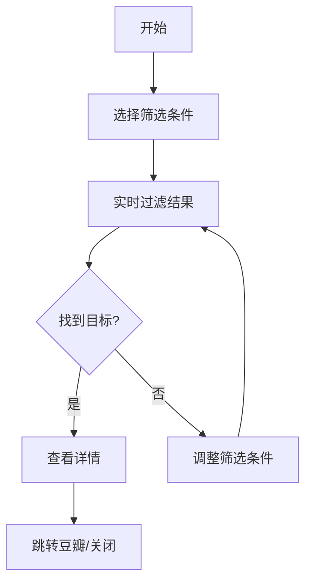

# 观影记录应用 PRD

## 1. 产品概述
一个优雅的观影记录管理应用，帮助用户整理和展示个人观影历史。通过精美的海报墙布局和强大的筛选功能，让用户能够轻松回顾和管理自己的观影记录。

### 主要目标
- 展示用户的观影历史，以美观的视觉方式呈现
- 提供多维度筛选和搜索功能，快速找到想看的影片
- 统计观影数据，帮助用户了解自己的观影偏好
- 支持从豆瓣链接快速访问影片详情

### 目标用户
- 热爱电影和剧集的观影爱好者
- 希望系统化管理观影记录的用户
- 需要回顾和推荐影片的用户

## 2. 核心功能

### 2.1 用户角色
| 角色 | 说明 | 权限 |
|------|------|------|
| 普通用户 | 观影记录管理者 | 浏览、筛选、搜索、查看统计 |

### 2.2 功能模块
1. **首页（观影墙）**: 海报墙展示模式，支持瀑布流和网格切换
2. **筛选面板**: 多维度筛选（年份、类型、国家/地区、评分、平台）
3. **搜索功能**: 实时搜索片名和标签
4. **详情弹窗**: 展示完整影片信息和备注
5. **统计面板**: 观影数据可视化（年度统计、类型分布、评分分布）

### 2.3 页面详情

#### 首页（观影墙）
- 瀑布流/网格切换视图
- 海报卡片展示（片名、评分、类型标签）
- 悬浮效果（显示更多详情）
- 滚动加载更多

#### 筛选面板
- 年份范围筛选（2022-2026）
- 类型筛选（电影、剧集、纪录片）
- 国家/地区筛选
- 观看平台筛选（BiliBili、Netflix、资源等）
- 评分范围筛选（1-10分）
- 标签筛选（科幻、犯罪、剧情等）

#### 搜索功能
- 片名搜索（支持中文和英文）
- 标签搜索
- 实时过滤

#### 详情弹窗
- 完整影片信息展示
- 豆瓣链接跳转
- 备注信息显示
- 关闭按钮和ESC快捷键

#### 统计面板
- 年度观影数量统计（柱状图）
- 类型分布（饼图）
- 平均评分展示
- 总观影时长估算
- 最常观看的平台

## 3. 核心流程

### 3.1 主流程
用户打开应用 → 浏览观影墙 → 使用筛选/搜索 → 查看详情 → 跳转豆瓣

### 3.2 筛选流程

## 4. 用户界面设计

### 4.1 设计风格
**主题**: 电影感暗色调 + 霓虹点缀

**配色方案**:
- 主色: `#1a1a2e` (深紫黑)
- 次色: `#16213e` (深蓝)
- 强调色: `#e94560` (霓虹红)
- 辅助强调: `#0f3460` (深蓝紫)
- 背景: `#0d0d1a` (纯黑紫)
- 文字: `#eaeaea` (柔白)
- 次要文字: `#8892b0` (灰蓝)

**字体**:
- 标题: `'Playfair Display', serif` - 优雅衬线体
- 正文: `'Inter', sans-serif` - 现代无衬线
- 中文: `'Noto Sans SC', sans-serif`

**布局**: 
- 瀑布流网格布局（桌面端4-5列，平板3列，手机2列）
- 左侧固定筛选面板（桌面端）
- 顶部导航栏含搜索框

**动效**:
- 卡片悬浮放大 + 阴影加深
- 页面切换渐变过渡
- 筛选条件变化时卡片重新排列动画
- 详情弹窗滑入效果

### 4.2 页面设计

#### 首页（观影墙）
| 模块 | 样式 | 布局 | 动效 |
|------|------|------|------|
| 导航栏 | 毛玻璃效果 | 固定顶部 | 滚动时背景加深 |
| 海报卡片 | 圆角12px，阴影 | 瀑布流 | 悬浮放大1.05x |
| 评分标签 | 霓虹红圆形徽章 | 卡片右下角 | 脉冲动画 |
| 类型标签 | 半透明胶囊 | 卡片左下角 | 悬浮时高亮 |

#### 筛选面板
| 模块 | 样式 | 布局 | 交互 |
|------|------|------|------|
| 面板容器 | 深色卡片 | 左侧固定（桌面） |
| 筛选按钮 | 霓虹边框 | 分组布局 | 点击发光效果 |
| 重置按钮 | 虚线边框 | 面板底部 | 悬浮时填充 |

#### 详情弹窗
| 模块 | 样式 | 布局 |
|------|------|------|
| 背景遮罩 | 深色半透明 | 全屏覆盖 |
| 弹窗容器 | 毛玻璃效果 | 居中显示 |
| 信息展示 | 卡片布局 | 左侧海报+右侧信息 |

### 4.3 响应式设计
- **桌面端 (>1024px)**: 左侧筛选面板 + 右侧观影墙
- **平板端 (768-1024px)**: 顶部筛选收起 + 3列网格
- **移动端 (<768px)**: 底部筛选抽屉 + 2列网格

### 4.4 视觉特色
- **光晕效果**: 卡片hover时产生柔和光晕
- **玻璃拟态**: 面板和弹窗使用毛玻璃背景
- **渐变边框**: 重点元素使用渐变边框
- **阴影层次**: 多个阴影层叠营造深度感
