# 观影记录应用 - 技术架构文档

## 1. 架构设计

### 1.1 系统架构图

```mermaid
graph TB
    A[用户界面层] --> B[React 应用]
    B --> C[状态管理层]
    C --> D[数据层]
    D --> E[本地CSV数据]
    
    A --> F[UI组件库]
    F --> G[recharts统计图表]
    F --> H[lucide-react图标库]
    
    style A fill:#e94560
    style B fill:#0f3460
    style C fill:#16213e
    style D fill:#1a1a2e
```


### 1.2 前端架构
```
├── src/
│   ├── components/          # 可复用组件
│   │   ├── MovieCard/       # 电影卡片组件
│   │   ├── FilterPanel/     # 筛选面板组件
│   │   ├── SearchBar/       # 搜索栏组件
│   │   ├── StatsPanel/      # 统计面板组件
│   │   ├── DetailModal/     # 详情弹窗组件
│   │   └── Layout/          # 布局组件
│   ├── pages/
│   │   └── Home/            # 首页
│   ├── hooks/               # 自定义Hooks
│   ├── store/               # Zustand状态管理
│   ├── data/                # 静态数据
│   ├── utils/               # 工具函数
│   └── App.tsx
```

## 2. 技术栈

### 2.1 核心技术
- **前端框架**: React@18 + TypeScript
- **构建工具**: Vite
- **样式方案**: Tailwind CSS@3
- **状态管理**: Zustand
- **路由管理**: React Router DOM
- **图表库**: Recharts
- **图标库**: Lucide React

### 2.2 项目初始化命令
```bash
pnpm create vite-init@latest . --template react-ts --force
pnpm install
pnpm add zustand react-router-dom recharts lucide-react
```

## 3. 路由定义

| 路由 | 用途 |
|------|------|
| `/` | 首页（观影墙 + 筛选 + 统计） |
| `/detail/:id` | 电影详情页（Modal形式） |

## 4. 数据模型

### 4.1 影片数据类型
```typescript
interface Movie {
  id: number;
  title: string;              // 片名
  altTitle: string;           // 其他片名
  year: number;               // 上映年份
  country: string;            // 国家/地区
  type: '电影' | '剧集' | '纪录片';  // 分类
  tags: string[];             // 标签
  platform: string;           // 观看平台
  rating: number;             // 我的评分
  doubanUrl: string;          // 豆瓣链接
  archiveDate: string;        // 归档日期
  notes: string;              // 备注
  archiveYear: number;        // 归档年份
}
```

### 4.2 筛选状态类型
```typescript
interface FilterState {
  searchQuery: string;
  yearRange: [number, number];
  type: string[];
  country: string[];
  platform: string[];
  ratingRange: [number, number];
  tags: string[];
}
```

## 5. 组件设计

### 5.1 MovieCard 组件
- **功能**: 展示电影海报卡片
- **状态**: default, hover
- **数据**: Movie对象
- **交互**: 点击打开详情，悬浮显示更多信息

### 5.2 FilterPanel 组件
- **功能**: 多维度筛选面板
- **子组件**: 
  - YearRangeSlider
  - TypeCheckbox
  - CountryMultiSelect
  - PlatformCheckbox
  - RatingRangeSlider
  - TagCloud
- **状态管理**: Zustand store

### 5.3 SearchBar 组件
- **功能**: 实时搜索片名
- **特性**: 
  - 防抖处理（300ms）
  - 清除按钮
  - 搜索图标

### 5.4 StatsPanel 组件
- **功能**: 观影数据统计
- **图表**:
  - 年度观影数量柱状图
  - 类型分布饼图
  - 评分分布柱状图
  - 平均分和总数展示

### 5.5 DetailModal 组件
- **功能**: 影片详情展示
- **内容**:
  - 片名（中文 + 英文）
  - 年份、国家、类型
  - 评分（星级可视化）
  - 标签
  - 观看平台
  - 备注
  - 豆瓣链接按钮
- **交互**:
  - 点击遮罩关闭
  - ESC键关闭
  - 动画过渡

## 6. 状态管理

### 6.1 Zustand Store 结构
```typescript
// store/movieStore.ts
interface MovieStore {
  movies: Movie[];
  filteredMovies: Movie[];
  filters: FilterState;
  setFilters: (filters: Partial<FilterState>) => void;
  resetFilters: () => void;
  applyFilters: () => void;
}
```

### 6.2 筛选逻辑
1. 搜索词匹配（片名、标签）
2. 年份范围过滤
3. 类型过滤
4. 国家/地区过滤
5. 平台过滤
6. 评分范围过滤
7. 标签过滤

## 7. 性能优化

### 7.1 渲染优化
- 使用 `useMemo` 缓存过滤结果
- 使用 `useCallback` 缓存事件处理函数
- 虚拟列表（如果数据量 > 500）

### 7.2 加载优化
- 骨架屏加载状态
- 图片懒加载
- 代码分割（详情弹窗）

### 7.3 响应式适配
- Tailwind 响应式类
- 媒体查询断点
- 移动端筛选抽屉

## 8. 数据源

### 8.1 CSV数据处理
- 解析CSV文件为JSON数组
- 数据清洗和类型转换
- 存储在 `src/data/movies.ts`

### 8.2 数据字段映射
| CSV字段 | TypeScript字段 |
|---------|---------------|
| 片名 | title |
| 其他片名 | altTitle |
| 上映年份 | year |
| 国家/地区 | country |
| 分类 | type |
| 标签 | tags (split by ',') |
| 观看平台 | platform |
| 我的评分 | rating |
| 海报 | poster (placeholder) |
| 豆瓣 | doubanUrl |
| 归档日期 | archiveDate |
| 备注 | notes |
| 归档年份 | archiveYear |
